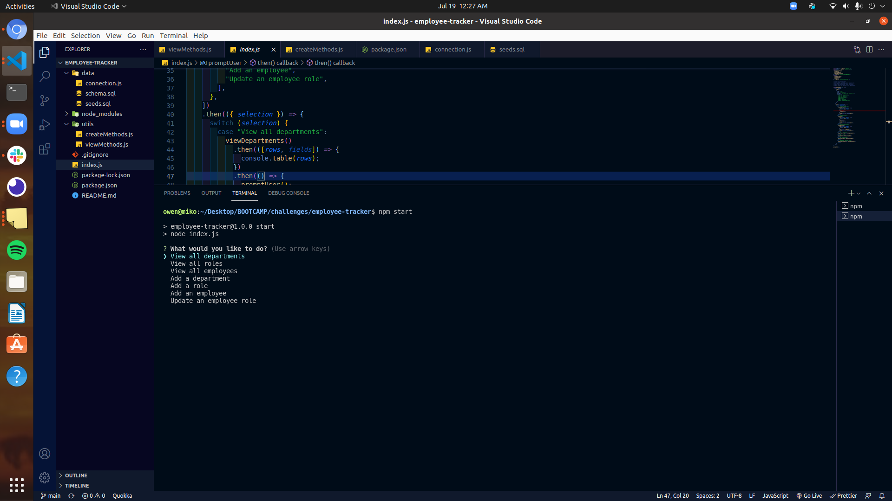
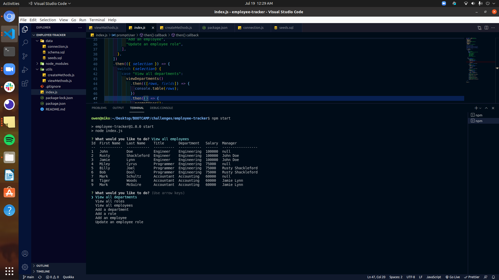

# Employee Tracker

## Description

This app is used to search business data by displaying employees, employee roles and departments.

---

## Table of Contents

- [Installation](#installation)
- [Usage](#usage)
- [License](#license)
- [Questions](#questions)

---

## Installation

After cloning the repository, run 'npm init' and 'npm install inquirer mysql2 console.table'.

---

## Usage

Start by running npm start in the terminal. Once the command has been entered, follow the prompts
to view, create or update the data that you wish to access.

[Instructional Video](https://drive.google.com/file/d/1czfF_bEfqxasp7QqGd3NOq9baHnTiVFQ/view)

---

## License

MIT

Copyright (c) 2021 Owen Dupree

Permission is hereby granted, free of charge, to any person obtaining a copy
of this software and associated documentation files (the "Software"), to deal
in the Software without restriction, including without limitation the rights
to use, copy, modify, merge, publish, distribute, sublicense, and/or sell
copies of the Software, and to permit persons to whom the Software is
furnished to do so, subject to the following conditions:

The above copyright notice and this permission notice shall be included in all
copies or substantial portions of the Software.

---

## Questions

For any questions please contact me directly.

Email: <odupree1988@gmail.com>

GitHub: [odupree1988](https://github.com/odupree1988)

Made By Owen Dupree 2021

---
